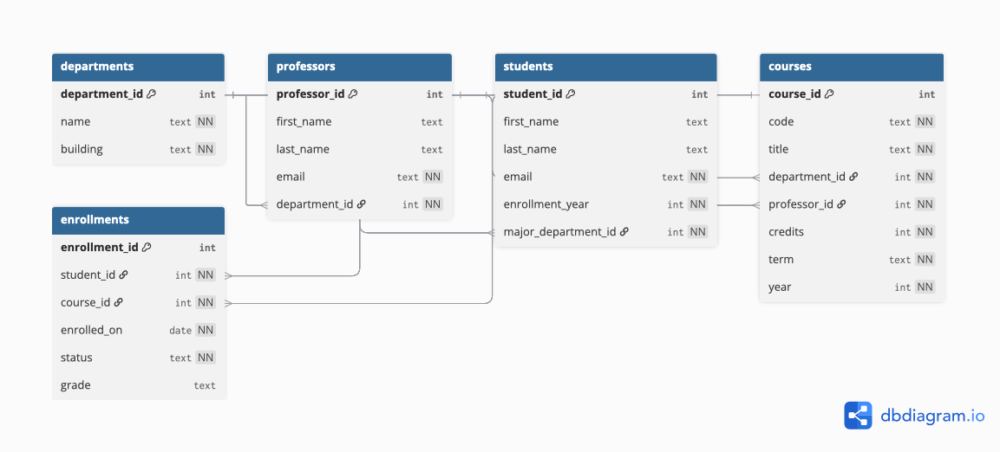

# University-Management-System-Database PostgreSQL
PostgreSQL self-created University Management System database provided with scheme, practice queries and ER diagram 

A compact, portfolio-ready relational database that demonstrates SQL proficiency across:

- Joins (inner,left,self)
- Subqueries 
- Aggregate functions 
- Window functions 
- CTE-based query organization

---

## Repo structure
<pre>
  ├── schema.sql # Full schema + seed data
  │
  └── queries/
    ├── 01_one_course_outside_of_major_dept.sql
    ├── 02_key_perfomance_indicators.sql
    ├── 03_avg_cred_+_total_courses.sql
    └── 04_compare_professors.sql
  │
  └── UMS_ED_Diagram.png # ER diagram image, can be found in README 
</pre>

---

## Entity-relationship diagram 
> Created using https://dbdiagram.io/


---

## Prerequisites
- PostgreSQL **14+** (tested on 14/15/16)
- `psql`(terminal based) or **pgAdmin 4** (friendly UI client) 

---

## Quickstart

**pgAdmin 4**
1) Create database (for instance: `university_db`)  
2) Right-click DB → **Query Tool** → open `schema.sql` → **Execute**

### Verify data loaded
```sql
SELECT 'departments' AS table, COUNT(*) FROM departments
UNION ALL SELECT 'professors', COUNT(*) FROM professors
UNION ALL SELECT 'students', COUNT(*) FROM students
UNION ALL SELECT 'courses', COUNT(*) FROM courses
UNION ALL SELECT 'enrollments', COUNT(*) FROM enrollments;
```

---

## How to run the example queries
Open each file in **pgAdmin** → Query Tool → Execute.

---

## Example Queries (Ready to Run)

### 1) Outside-major enrollment 
**File:** `01_one_course_outside_of_major_dept.sql`  
Finds students who took at least one course **outside** their major department.

### 2) Department KPI health report 
**File:** `02_key_perfomance_indicators.sql`  
One row per department: majors, courses offered, completions, average GPA, drop rate, and **top professor** by completions.

### 3) Average credits & total courses per department 
**File:** `03_avg_cred_+_total_courses.sql`  
Shows average course credits and total distinct courses per department.

### 4) Professor self-join comparison 
**File:** `04_compare_professors.sql`  
Builds per-professor load/outcomes, then self-joins to highlight large gaps.

---

## Sample outputs 

```text
-- 01_one_course_outside_of_major_dept.sql (first few rows)
 student_id | first_name | last_name
------------+------------+----------
 3          | Alex       | Taylor
 7          | Jamie      | Brown
 15         | Riley      | Clark
```

```text
-- 02_key_perfomance_indicators.sql (first few rows)
 department        | majors | courses | completed | avg_gpa | drop_rate_pct | top_professor
-------------------+--------+---------+-----------+---------+---------------+--------------
 Computer Science  |   11   |   6     |    58     |  3.12   |     8.6       | Jordan Lee
 Mathematics       |    8   |   5     |    41     |  2.98   |     7.1       | Morgan Hall
```

---

## Contact (for any questions or collaboration inquiries)
Kanstantsin Nechyparenka — nklimfet@gmail.com (personal), nechypak@oregonstate.edu (school) 

